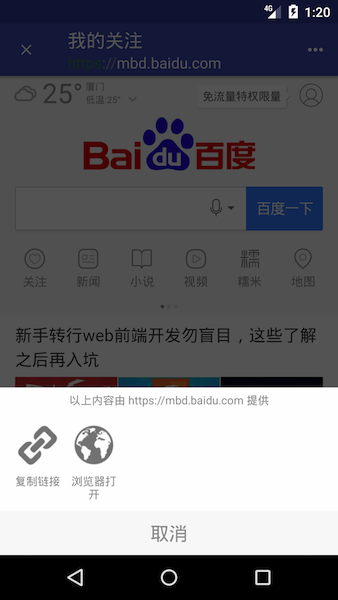

## 浏览
 
.

## 概要
- 支持左右滑动, 前进后退。
- 支持会退键后退。
- 支持 toolbar 中的 title 滑动查看网页标题。
- 支持 toolbar 双击回到顶部。
- 支持 toolbar 下滑隐藏，上滑显示。
- 支持网页加载进度条。
- ~~支持自定义设置浏览器细节及配色~~

## 使用
1. 在 `AndroidManifest.xml` 添加必要权限.
```xml
    <manifest>
        <uses-permission android:name="android.permission.INTERNET"/>
        ...
    </manifest>
```
2. 在 `AndroidManifest.xml` 添加 `BrowserActivity` 配置
```xml
    <application>
        ...
        <activity android:name=".BrowserActivity"
                  android:theme="@style/AppTheme.NoActionBar"
            >
            <intent-filter>
                <action android:name="in.hocg.app.intent.action.Browser_VIEW"/>
            </intent-filter>
        </activity>
    </application>
```

3. 调用 `BrowserActivity`
```java
    Intent intent = new Intent(this, BrowserActivity.class);
	intent.setData(Uri.parse("https://www.baidu.com"));
	startActivity(intent);
```
4. (可选)添加左侧功能栏
```java
    bfb.addButton(R.mipmap.ic_launcher, new View.OnClickListener() {
			@Override
			public void onClick(View v) {
				Toast.makeText(getBaseContext(), "可进行点赞类的操作..", Toast.LENGTH_SHORT).show();
			}
		});
``````
5. (可选)添加底部弹窗功能
```java
       moreDialog.addButton("浏览器打开", R.drawable.ic_action_globe, new View.OnClickListener() {
   			@Override
   			public void onClick(View v) {
   				LangKit.openBrowser(getBaseContext(), browserView.getUrl());
   				moreDialog.cancel();
   			}
   		});
```
6. (可选)关于 Toolbar 配色
请修改 styles.xml.